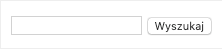
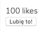

## Zadanie 1 - rozwiązywane z wykładowcą

> ### Przygotowanie
>
> Zmodyfikuj plik `vite.config.js` tak, aby zmienna `exercisePath` wskazywała na:
>
> - `07_Dzien_4/01_Podstawy/01_Zadanie_1`
>
> **Pamiętaj aby włączyć serwer deweloperski (`npm run dev`).**

Stwórz komponent wyszukiwarki. Powinien on posiadać jedno pole tekstowe `input` i obok `button` "Wyszukaj".

Póki co, komponent ten ma nic więcej nie robić. Wyrenderuj go na stronie.

Zadanie wykonaj w dwóch wersjach:

- Najpierw z komponentem w wersji funkcyjnej
- Oraz z tym samym komponentem w wersji zbudowanej z klasy ES6

Przykładowy wynik:

## Zadanie 2

> ### Przygotowanie
>
> Zmodyfikuj plik `vite.config.js` tak, aby zmienna `exercisePath` wskazywała na:
>
> - `07_Dzien_4/01_Podstawy/02_Zadanie_2`
>
> **Pamiętaj aby włączyć serwer deweloperski (`npm run dev`).**

Stwórz komponent o nazwie `LikeBox`.

Powinien on składać się z licznika polubień oraz przycisku do kliknięcia, że użytkownikowi podoba się dana treść.

Póki co, komponent ten ma nic więcej nie robić. Wyrenderuj go na stronie. Zadanie wykonaj w oparciu o **komponent funkcyjny**.

Przykładowy wynik:

## Zadanie 3

> ### Przygotowanie
>
> Zmodyfikuj plik `vite.config.js` tak, aby zmienna `exercisePath` wskazywała na:
>
> - `07_Dzien_4/01_Podstawy/03_Zadanie_3`
>
> **Pamiętaj aby włączyć serwer deweloperski (`npm run dev`).**

Stwórz komponent `Menu`. Powinien on składać się z pojedynczego elementu listy `ul`, a w niej powinny się pojawić elementy `li`, w których będą odpowiednie odnośniki `a`.

Lista: nazwa - odnośnik

- Strona główna - /
- Blog - /blog
- Cennik - /cennik
- Kontakt - /kontakt

Wyrenderuj komponent na stronie. Zadanie wykonaj w oparciu o **komponent klasowy**.
