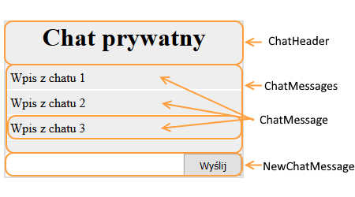

## Zadanie 1 - rozwiązywane z wykładowcą

> ### Przygotowanie
>
> Zmodyfikuj plik `vite.config.js` tak, aby zmienna `exercisePath` wskazywała na:
>
> - `07_Dzien_4/04_Kompozycja_i_props_children/01_Zadanie_1`
>
> **Pamiętaj aby włączyć serwer deweloperski (`npm run dev`).**

Stwórz komponenty `ParentComponent`, `ChildComponent` oraz `GrandchildComponent`.

- Niech `ParentComponent` renderuje `ChildComponent`, przekazując mu jako dzieci swoje dzieci.

- `ChildComponent` renderuje `GrandchildComponent`, przekazując mu jako dzieci swoje dzieci.

- `GrandchildComponent` po prostu wyświetla swoje dzieci.

Wyrenderuj i przetestuj swój komponent za pomocą takiej konstrukcji:

```js
<ParentComponent>
  <h1>To działa!</h1>
</ParentComponent>
```

Kod ten powinien wyświetlić taką strukturę:

```
-- ParentComponent
    |-- ChildComponent
          |-- GrandchildComponent
                |-- <h1>To działa!</h1>
```


## Zadanie 2 - rozwiązywane z wykładowcą

> ### Przygotowanie
>
> Zmodyfikuj plik `vite.config.js` tak, aby zmienna `exercisePath` wskazywała na:
>
> - `07_Dzien_4/04_Kompozycja_i_props_children/02_Zadanie_2`
>
> **Pamiętaj aby włączyć serwer deweloperski (`npm run dev`).**

Stwórz komponent `ShopItem` z odpowiednimi `props`, które wynikają z dalszej części zadania. Ma mieć on następującą strukturę:

```html
<section>
  <header>
    <h1>{title z props}</h1>
    
  </header>
  <article>
    <p>{description z props}</p>
  </article>
  <footer>
    Cena: {price z props} zł
    <button>Kup!</button>
  </footer>
</section>
```

Następnie podziel go na 4 komponenty:

- `ShopItemHeader`
- `ShopItemDescription`
- `ShopItemPricing`
- `ShopItem` - ma podstawową strukturę i korzysta z powyższych.

Wyrenderuj na stronie komponent `ShopItem` używając kompozycji, podając w `props` konkretnych komponentów przykładowe dane:

```json
{
  "title": "MacBook Pro",
  "image": "https://bit.ly/2EEtduD",
  "description": "Moc i mobilność – MacBook Pro wyraźnie podnosi tu poprzeczkę. Teraz możesz jeszcze szybciej realizować swoje pomysły. Pomogą Ci w tym wydajne procesory i układy pamięci, zaawansowana grafika, błyskawicznie działająca pamięć masowa i inne doskonałe rozwiązania.",
  "price": 9999
}
```

Pamiętaj aby zbudować także główny komponent `App`, a w nim wykorzystywać komponenty budowane w ćwiczeniach. Renderuj na stronie główny komponent `App`.

Zadanie wykonaj tylko z **komponentami w wersji zbudowanej z funkcji**.


## Zadanie 3

> ### Przygotowanie
>
> Zmodyfikuj plik `vite.config.js` tak, aby zmienna `exercisePath` wskazywała na:
>
> - `07_Dzien_4/04_Kompozycja_i_props_children/03_Zadanie_3`
>
> **Pamiętaj aby włączyć serwer deweloperski (`npm run dev`).**

Wykorzystaj zadanie zrobione z wykładowcą.

Stwórz komponent o nazwie `ShopList`. Niech przyjmuje on w `props` tablicę obiektów z elementami koszyka.

Obiekty mają być w takiej formie:

```js
{
  title: "nazwa przedmiotu",
  image: "url_do_obrazu_przedmiotu"
}
```

Powinien on wyświetlać w divie o klasie CSS `shoplist` same komponenty `ShopItemHeader` z odpowiednimi danymi. Wykorzystaj `map()`.

Wyrenderuj go na stronie, podając w atrybucie do props następujący atrybut `items`:

```js
[
  {
    title: 'Mysz komputerowa',
    image: 'https://upload.wikimedia.org/wikipedia/commons/c/c5/Red_computer_mouse.jpg',
  },
  {
    title: 'Klawiatura',
    image:
      'https://upload.wikimedia.org/wikipedia/commons/thumb/6/66/Computer_keyboard_Danish_layout.svg/1000px-Computer_keyboard_Danish_layout.svg.png',
  },
  {
    title: 'Laptop programisty',
    image:
      'https://upload.wikimedia.org/wikipedia/commons/thumb/b/b9/Typing_computer_screen_reflection.jpg/640px-Typing_computer_screen_reflection.jpg',
  },
];
```

Pamiętaj aby zbudować jeszcze główny komponent `App`, a w nim wykorzystywać komponenty budowane w ćwiczeniach. Renderuj na stronie główny komponent `App`.

Zadanie wykonaj tylko z **komponentami w wersji zbudowanej z klas ES6**.


## Zadanie 4

> ### Przygotowanie
>
> Zmodyfikuj plik `vite.config.js` tak, aby zmienna `exercisePath` wskazywała na:
>
> - `07_Dzien_4/04_Kompozycja_i_props_children/04_Zadanie_4`
>
> **Pamiętaj aby włączyć serwer deweloperski (`npm run dev`).**

W pliku przygotowanym do zadania jest stworzony komponent `Chat`. Podziel go według tego schematu:



**Zadanie wykonaj z komponentami w wersji funkcyjnej**
